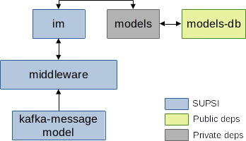

# [BF] Intervention Manager (IM)

This repository describes how to use the Docker image for the *im* component, as part of the Cognitive Human Robot Interaction (C-HRI) scenario defined within the Better Factory project. The deployment is provided by means of Docker Compose, and the set of initialized components is depicted in the picture here below:



The blue-colored components represent the core components for which SUPSI provides and maintains a Docker image; the other components (grey- and green-colored) represent dependencies that are provided as Docker images by third parties.

> NOTE: In this deployment version, the only external dependencies that is available only in a private registry is *models*. The *models* image is provided and maintained by Holonix (HOL) within the Better Factory project.

### im
The *im* component allows users to easily define intervention rules to orchestrate a production system. The component monitors the status of the worker-factory ecosystem in real-time, by elaborating data from sensors, machines, workers monitoring systems, ERP, and more. The set of intervention rules are known to the *im*, which decides which is the best one to trigger.

### Dependencies

#### middleware

The image is based on the [fast-data-dev (v2.6.2)](https://github.com/lensesio/fast-data-dev/tree/fdd/2.6.2) project by Lenses.io and runs a full fledged Kafka installation (including extra services, e.g., UIs).

In addition, the Schema Registry is automatically populated with schemas available under the `/schemas` directory. In our deployment, the `/schemas` directory is read from the *kafka-message-model* component.

The middleware is run in secure mode and can be accessed at [localhost:3040](localhost:3040) (credentials are stored in the docker-compose file).

#### kafka-message-model
This component embeds the data model shared within the Better Factory project. The data model is automatically uploaded to the Schema Registry available within the *middleware*.

#### models
The *models* component exposes a REST API to access the data model shared among all the components involved in the C-HRI scenario. The API is accessed by both the *fams* and *im* components to fetch information about workers and other factory elements.

> NOTE: this image is available in a private Docker registry hosted at GitLab. Please ask HOLONIX to get access to this image.

#### models-db
The *models-db* component runs an official MySql docker image (v5.7).

## How to Use

### Requirements

All the components are provided as Dockerized applications, thus the following software is required:

- Docker
- Docker Compose

We tested our deployment on a machine running Ubuntu 21, with Docker v20.10.8, and Docker Compose v1.29.2.

### Install

Before running the containers, it is required to download the Docker images from their respective registries.
While some images are publicly available, some other require credentials to be downloaded from private registries.

> NOTE: Images provided by SUPSI can be download from the GitLab container registry, which supports the token-based authentication. Please send your request for a new token to the repository maintainers.

Once you are provided with a username and a token, you can issue the following command to login to the private GitLab Docker registry and download the images:

```shell
docker login registry.example.com -u <username> -p <token>
docker-compose pull
```

### Usage
The docker-compose file automatically runs all the components as Docker containers. Each container can be customized by editing its environment parameters. The current deployment already set the right values for all the parameters.
We suggest the user to only modify variables listed in the `.env` file, if needed.

| Parameter name             | Parameter value | Default |
| -------------------------- | --------------- | ------  |
| BF_USER | A username shared by all the components | **bfuser** |
| BF_PASSWORD | A password shared by all the components | **bfpwd123** |
| MODELS_MYSQL_DATABASE | Name of the database to store the shared model | **models**|
| MODELS_MYSQL_ROOT_PASSWORD | Password for the root user in MySQL | **root** |

Run the **up** command to start all the containers:

```shell
docker-compose up -d
```

You can now access different components:

- The IM is available at [localhost:8666](http://localhost:8666); you can use the IM UI to edit the possible interventions available for the factory. The intervention will be triggered by the IM and written to the *middleware* component.

- Kafka is accessible from the Kafka Development Environment, which is available at [localhost:3040](http://localhost:3040/). Here you can check schemas uploaded to the Schema Registry, as well as existing Kafka topics and their content.

## Maintainers

- Vincenzo Cutrona - vincenzo.cutrona@supsi.ch
- Niko Bonomi - niko.bonomi@supsi.ch
- Giuseppe Landolfi - giuseppe.landolfi@supsi.ch
